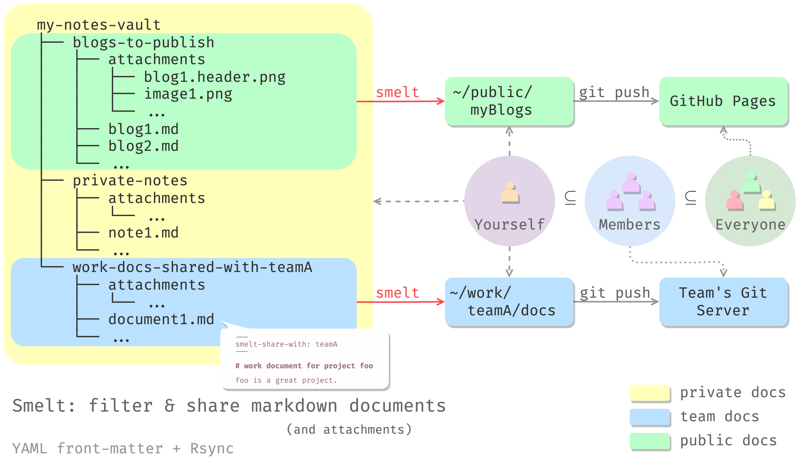

# smelt: filter & share markdown documents

`smelt` is a command-line tool for filtering specific Markdown documents
based on their front-matter (the YAML metadata at the beginning of the
Markdown files) and rsync (share) them from a directory tree to another.



## Synopsis

```shell
smelt --key KEY --value VALUE 
      [--include-attachment ATTACHMENT_DIR] 
      < --print | --rsync-to DEST >
      SRC
```

## Motivation

I keep a mono repo of all my notes, blogs, and other documents in
Markdown format. I use [Obsidian](https://obsidian.md/) and
[Typora](https://typora.io/) to edit them.

There are some documents that I want to publish on my blog and there
are other documents that I want to share with my team, and there are
of course some documents that I want to keep private. All of these
documents are organized in a single directory tree for ease of
management:

```
my-notes-vault
├── blogs-to-publish
│   ├── attachments
│   │   ├── blog1.header.png
│   │   ├── image1.png
│   │   └── ...
│   ├── blog1.md
│   ├── blog2.md
│   └── ...
├── private-notes
│   ├── attachments
│   │   └── ...
│   ├── note1.md
│   └── ...
└── work-documents-shared-with-team
    ├── attachments
    │   └── ...
    ├── document1.md
    └── ...
```

I used to manually copy the files to other directories and then
publish or share them manually, one by one. This is tedious.

So I had written some scripts to automate the process. But then I
realized that I always put the wrong files in the mono repo directories.
This careless lead to my stupid scripts sharing those files with wrong people.
Sometimes I have to delete (or worse, recall) the files. Embarrassing.

Leaking private information is not fun.

So I wrote `smelt` to help me filter the files based on their front-matter.
This way I can control whether a file should be shared or not by simply
adding a few lines of YAML metadata at the beginning of the file.
Much easier and safer.

## Installation

From source:

```shell
git clone https://github.com/cdfmlr/smelt.git
cd smelt
cargo install --path .

# now you can use smelt: 
smelt --version
```

## Usage

`smelt --help` for command-line options.
Here is a ~~quick start~~ verbose explaining:

### front-matter

Add front-matter to your Markdown files:

```md
---
smelt-share-with: foo-team
---

# work document for project foo

foo is a great project.
```

### smelt

Use `smelt` to filter and share those front-matter tagged files:

```shell
smelt --key "smelt-share-with" --value "foo-team" \
      --rsync-to /path/to/foo-team-repo \
      /path/to/my-notes-vault
```

This will filter all the Markdown files that have the `smelt-share-with`
key in their front-matter and the value of the key is `foo-team`, and
then rsync them to `/path/to/foo-team-repo`.

The result is that the `foo-team-repo` will have and only have the
markdown files that filtered out from the `my-notes-vault` directory.

You can customize the key and value to filter the files you want to share.

### attachments

Optionally, if you have attachments (images, etc.) that you want to share
with the filtered files, and these attachments are in a subdirectory of
the vault,
you can use `--include-attachment` to specify
the attachment directory:

```shell
smelt --key "smelt-share-with" --value "foo-team" \
      --include-attachment "attachments" \
      --rsync-to /path/to/foo-team-repo \
      /path/to/my-notes-vault
```

This will rsync `/path/to/my-notes-vault/**/attachments/*` to the destination
directory.

#### min markdowns, max attachments

Note that (by now) I have no way to filter out only the attachments that
are related to the filtered markdown files. So: **no mono attachment directory**.

A good practice is to roughly organize your markdown files you want to share
in different directories and put the attachments directory in the same directory
as the markdown files.
(It's easy to implement, there are settings in both Obsidian and Typora to
save the images into a relative directory of the markdown file.)

```
└── work-documents-shared-with-team
    ├── attachments
    │   └── image-used-in-document1.png
    ├── document1.md
    └── ...
```

And calls `smelt` on the minimal source directory:

```shell
smelt --key "smelt-share-with" --value "foo-team" \
      --include-attachment "attachments" \
      --rsync-to /path/to/foo-team-repo \
      /path/to/work-documents-shared-with-team
```

This way helps to make sure that only front-matter filtered markdowns
and all the (maybe-related) attachments are shared.

You may still have to remove
unrelated attachments manually from the destination directory after
`smelt` is done. But at least you will not share all your attachments.

Remember: min markdowns and max attachments are shared.

## License

MIT OR Apache-2.0
